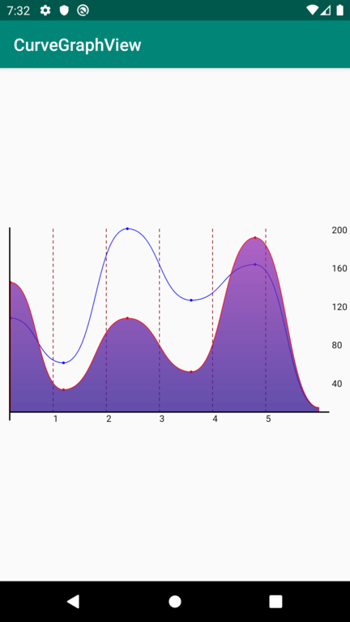
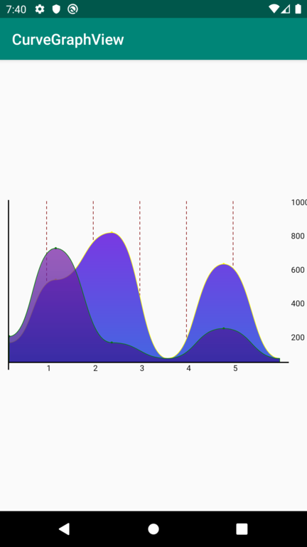

# CurveGraphView

[](https://jitpack.io/#swapnil1104/CurveGraphView)

A highly customizable and performant custom view to render curved line graph.



## Packed with features
- Add multiple line graphs within one graph plane.
- Extensible styling options.
- Performant and light weight.

## How to integrate the library in your app?
Step 1: Add it in your root build.gradle at the end of repositories:

```
allprojects {
    repositories {
        maven { url "https://jitpack.io" }
    }
}
```
Step 2. Add the dependency

```
dependencies {
    implementation 'com.github.swapnil1104:CurveGraphView:{current_lib_ver}'
}
```
Step 3. Add CurveGraphView to your layout file

```
 <com.broooapps.graphview.CurveGraphView
        android:id="@+id/cgv"
        android:layout_width="0dp"
        android:layout_height="250dp"
        app:layout_constraintBottom_toBottomOf="parent"
        app:layout_constraintEnd_toEndOf="parent"
        app:layout_constraintStart_toStartOf="parent"
        app:layout_constraintTop_toTopOf="parent" />
```

## How to customize the view.

```
curveGraphView = findViewById(R.id.cgv);

curveGraphView.configure(
        new CurveGraphConfig.Builder(this)
                .setAxisColor(R.color.Blue)                                             // Set X and Y axis line color stroke.
                .setIntervalDisplayCount(7)                                             // Set number of values to be displayed in X ax
                .setGuidelineCount(2)                                                   // Set number of background guidelines to be shown.
                .setGuidelineColor(R.color.GreenYellow)                                 // Set color of the visible guidelines.
                .setNoDataMsg(" No Data ")                                              // Message when no data is provided to the view.
                .setxAxisScaleTextColor(R.color.Black)                                  // Set X axis scale text color.
                .setyAxisScaleTextColor(R.color.Black)                                  // Set Y axis scale text color
                .build()
        ););
```
## How to provide data to the view.
### Create PointMap object

The graph view points the plot with keeping 2 values in mind, **span** and **value**
**span** relates to the x-coordinate, and **value** relates to the y-coordinate.
Create the object by providing values as shown below.
```
PointMap pointMap = new PointMap();
        pointMap.addPoint(0, 100);
        pointMap.addPoint(1, 500);
        pointMap.addPoint(5, 800);
        pointMap.addPoint(4, 600);

```

### Create GraphData object for each PointMap

A GraphData object expects a **PointMap**, **strokeColor** of the graph, and an optional **gradientColor**.
Create a GraphData object as shown below.
```
GraphData gd = GraphData.builder(this)
       .setPointMap(pointMap)                                                   // PointMap datqa
       .setGraphStroke(R.color.Black)                                           // Graph line stroke color
       .setGraphGradient(R.color.BlueViolet, R.color.RoyalBlue)                 // Graph fill gradient color
       .setStraightLine(true)                                                   // true for straight line; false for curved line graph
       .setPointRadius(10)                                                      // set point radius
       .setPointColor(R.color.Red)                                              // set point color
       .build();
```

### Provide the array of GraphData to CurveGraphView
Provide the above constructed data to CurveGraphView via the **curveGraphView.setData(int span, int maxVal, GraphData... gds)** method.
dscription of the params:
- span: is the range from 0...<span_value> i.e. this is the range of x-axis.
- maxVal: is the maximum plottable value for Y axis.
- gds... : is the array of GraphData objects.


## Sample Code
```
curveGraphView = findViewById(R.id.cgv);

curveGraphView.configure(
        new CurveGraphConfig.Builder(this)
                .setAxisColor(R.color.Blue)                                             // Set X and Y axis line color stroke.
                .setIntervalDisplayCount(7)                                             // Set number of values to be displayed in X ax
                .setGuidelineCount(2)                                                   // Set number of background guidelines to be shown.
                .setGuidelineColor(R.color.GreenYellow)                                 // Set color of the visible guidelines.
                .setNoDataMsg(" No Data ")                                              // Message when no data is provided to the view.
                .setxAxisScaleTextColor(R.color.Black)                                  // Set X axis scale text color.
                .setyAxisScaleTextColor(R.color.Black)                                  // Set Y axis scale text color
                .build()
);


PointMap pointMap = new PointMap();
pointMap.addPoint(0, 100);
pointMap.addPoint(1, 500);
pointMap.addPoint(4, 600);
pointMap.addPoint(5, 800);

GraphData gd = GraphData.builder(this)
        .setPointMap(pointMap)
        .setGraphStroke(R.color.Black)
        .setGraphGradient(R.color.BlueViolet, R.color.RoyalBlue)
        .build();

PointMap p2 = new PointMap();
p2.addPoint(0, 140);
p2.addPoint(1, 700);
p2.addPoint(2, 100);
p2.addPoint(3, 0);
p2.addPoint(4, 190);

GraphData gd2 = GraphData.builder(this)
        .setPointMap(p2)
        .setGraphStroke(R.color.Green)
        .setGraphGradient(R.color.gradientStartColor, R.color.gradientEndColor)
        .build();


curveGraphView.setData(5, 1000, gd, gd2);
```
